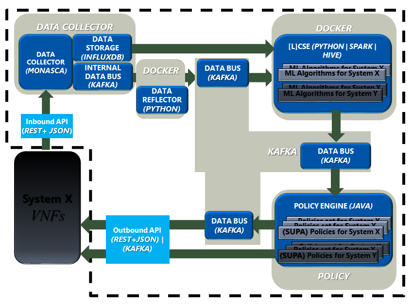
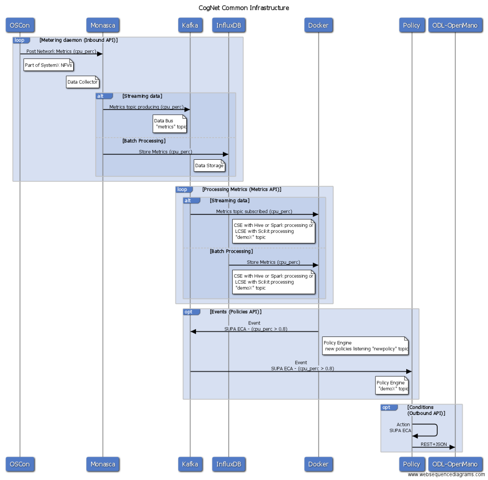
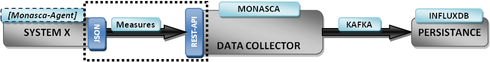
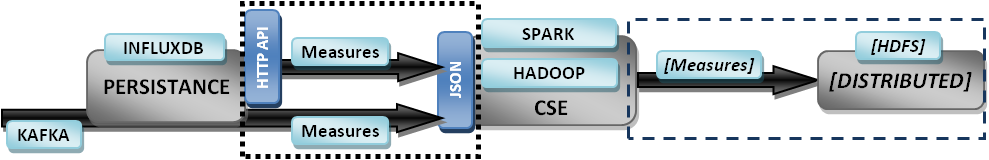
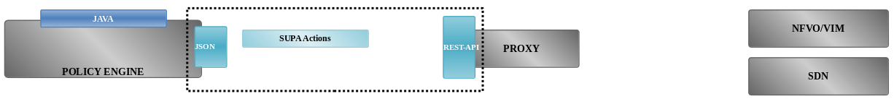
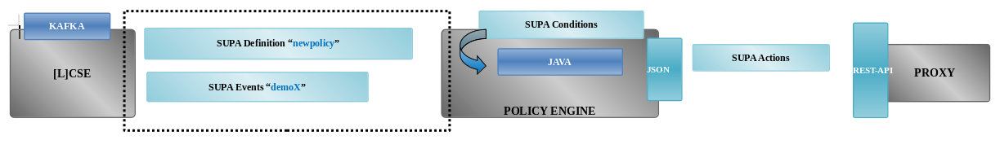
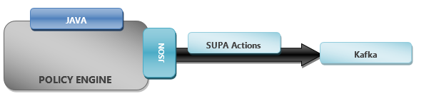

# API #

# Warning

All ips shown in this example are not updated, they are example ones.
Each time CogNet infrastructure is deployed different servers get new dynamic ips. There is an automatically updated list of those ips/hosts combination in [hosts](https://github.com/CogNet-5GPPP/demos_public/blob/master/hosts) file from demos_public repository.

## Navigation 
[Overview][] | [Approach][] | [Inbound][] | [Metrics][] | [Events][] | [Outbound][]

## Overview 
[Top][]

The CogNet solution performs data capturing, data processing and decision recommendation consequently. This way, the deployment and integration of an existing virtualized infrastructure with the CogNet solution is limited to the data ingest and the policy recommendation embodied in two Apis_public (Inbound and Outbound from the CogNet platform perspective) that decouple the CogNet solution from the analysed and optimized system to be autonomously managed.

1. The Inbound API. This is feed with measures coming from the managed system, through the monitoring system, to the data collector.
2. The Outbound API. It provides policy recommendations accordingly to the identified and forecasted events.



Additionally some Internal Apis_public, from the point of view of implementation, connect/glue the major entities from the CogNet Infrastructure.

3. Data Collector – CogNet Smart Engine. This lets CSE access to measures coming from the monitored infrastructure attached to a specific time and item.
4. CogNet Smart Engine – Policy Engine. This provides evidences, situations, identified and notified to the Policy Engine as soon as they are detected or predicted by the CSE.

In terms of the data conveyed across the different components uniform expressions, namespace and schemas, will be defined around: 

* Processed data
* Targeted features 
* Planned actions 

The design of the available software modules and interfaces of the CogNet constitute the operability across the targeted components that are needed for the unification of the data fields available from each component.

## Approach
[Top][]

Here some general principles are listed:

* Keep modular design based on independent components that allows multiple alternative configurations, making the system flexible.
* Enable scaling to concurrent systems and intensive requests.
* Adopt open interfaces based on industry standards maximizing interoperability and project impact. As much as possible we would avoid to reinvent the wheel taking solutions already available and in place. Those solutions too complex that goes beyond the intended use will be trimmed when possible.
* Resilient to recover from bad states and outages.
* Structured data in JSON format, relying on a REST protocol in most cases, and especially during this initial stage.
* Authentication and authorisation are not considered at this stage. Token requirements will be considered later on.

It is important to highlight that the interfaces described here take the Architecture from WP2 and land it to specific technologies employed in the implemented CogNet infrastructure for demos_public demonstration.

Some decisions concerning simplicity, practicality and impact was to take SUPA ECA tree and trim it to express:

* Events (Triggers coming from CSE)
* Actions (Policies coming from Policy Engine)
* Conditions (Rules applied to Triggers by the Policy Engine)

This way the information shared between the CSE, the Policy Engine and the Proxy has a consolidated format.

Here we can see deeper the kind of information transmitted from each block to the next one, the push/pull working mode and the technologies implied.



Here the four interfaces that will serve the components integration and the related data formats to be used in each case. A first approach to the façade and the information to be exchanged by means of these interfaces is provided below.

---
## Inbound
> (System – Data Collector)

[Top][] | [Inbound][] | [Metrics][] | [Events][] | [Outbound][]

This interface will convey the measures that a given system is collecting from the managed infrastructure.

### Technologies

The SW stack involved here is as follows:

* Data Collector: Monasca (https://wiki.openstack.org/wiki/Monasca). Monitoring-as-a-service solution that integrates with OpenStack.
* Message Broker: Apache Kafka (http://kafka.apache.org). Apache Kafka is publish-subscribe messaging rethought as a distributed commit log. Kafka is a high performance, distributed, fault-tolerant, and scalable message queue with durability built-in.
* Data Storage: InfluxDB (http://influxdb.com/). An open-source distributed time series database with no external dependencies. InfluxDB is supported for the Metrics Database.

### API

Monasca provides an API for real-time storage and retrieval of metrics and statistics. The main features of metrics are as follows (http://monasca.io/components/metrics/):

* Storage and retrieval of metrics.
* Push-based, streaming of metrics. Monasca support pushing metrics to the API, and does not support pull-based metrics.
* Query statistics about metrics, such as average, min, max, sum and count, over time ranges and periods.
* Multi-dimensional representation based on dimensions, (key, value) pairs to that data can be easily sliced and diced.
* Millisecond resolution.
* Meta data associated with metrics can be used to provide additional information about metrics such as http status codes and error messages. For example, if Nagios plugins are run by the Monasca Agent, the resulting error description can be sent as meta data with the metric.
* Long data retention periods of metrics in their original fidelity, without lossy compression and rollups.

We have decided to use Monasca as a default Data Collector. Monasca brings a REST-API, so those systems not using the Monasca monitoring stack must send the collected measures to the Monasca REST-API. For those systems able to setup Monasca stack the Monasca Agent performs the collection and delivery of local measures.
(https://github.com/openstack/monasca-api/blob/master/docs/monasca-api-spec.md)



### Format
User may add any metric according to what his system needs and his ML algorithm expects while keeping consistency with the namespace expressed here. Some of the general measures that use case demonstrators are considering in their experiments are:

* CPU%, RAM%
* BW in, BW Out, Latency, Connections#, Dropped#, Hops#
* Topology size, topology type, clients volume, entity ID
* Raw packets, Tstat (http://tstat.polito.it/) 

All the measures are timestamped.

Monasca supports pushing metrics to the API. In those systems where streaming of metrics can be done by deployed Monasca Agents, they captures system metrics: cpu, memory, network, disk and file-system utilization:

* cpu.user_perc: Percentage of time the CPU is used at the user level
* mem.usable_perc: Percentage of total memory that is usable
* net.in_bytes_sec: Number of network bytes received per second
* net.out_bytes_sec: Number of network bytes sent per second
* net.in_packets_dropped_sec: Number of inbound network packets dropped per second
* net.out_packets_dropped_sec: Number of inbound network packets dropped per second

http://monasca-agent.readthedocs.io/en/latest/Plugins/#system-metrics 

Keeping new features consistent with the already defined metrics new ones should be:

* net.connections_number
* net.hops_average
* net.topology_type

In order to consider Tstat measures (http://tstat.polito.it/measure.shtml) the summarization of data transmission for specific protocols will be pushed to Monasca.

A measurement is a value with a timestamp for a specific Metric. The value is represented by a double, e.g. 42.0 or 42.42.

More in particular an example request to POST a single metric.
```
POST /v2.0/metrics HTTP/1.1
Host: 192.168.10.4:8080
Content-Type: application/json
X-Auth-Token: 27feed73a0ce4138934e30d619b415b0
Cache-Control: no-cache
{
   name: cpu.user_perc,
     dimensions: {
       instance_uuid: abc123
       hostname: hostname.domain.com,
       region: uswest,
       zone: 1,
       service: compute
   },
   "timestamp":1405630174123,
   "value":1.0,
     value_meta: {
       status_code: 400,
       msg: Internal server error
   }
}
```

[https://github.com/openstack/monasca-api/blob/master/docs/monasca-api-spec.md#post-v20metrics](https://github.com/openstack/monasca-api/blob/master/docs/monasca-api-spec.md#post-v20metrics)

Having a look on that we can see that the headers include

* X-Auth-Token (string, required) - Keystone auth token
* Content-Type (string, required) - application/json

In terms of setting an origin of the measure, an optional parameter can be added to the query

* tenant_id (string, optional, restricted) - Tenant ID to create metrics on behalf of. Usage of this query parameter is restricted to users with the monitoring-delegate role.

The request body consists of a single metric object or an array of metric objects with the following properties:

* name (string(255), required) - The name of the metric.
* dimensions ({string(255): string(255)}, optional) - A dictionary of user-defined (key, value) pairs that are used to uniquely identify a metric and can be used to filter and slice-and-dice metrics.
* timestamp (string, required) - The timestamp in milliseconds from the Epoch.
* value (float, required) - Value of the metric. 
* value_meta ({string(255): string}(2048), optional) - An optional dictionary of user-defined (key, value) pairs that can be used to describe a measurement. Value_meta is typically used to decribe status codes and error messages.

The name and dimensions are used to uniquely identify a metric.

The hostname expresses the name of VM as provisioned, while the zone is related to availability.

In order to map resource on which the sampling was done the instance_uuid would keep the UUID. This unique name will stay constant between invocations, not depending on the clock. This is important to be able to identify a server even if its drives have been wiped clean. Thus, later CSE and ML algorithms can point to this resource.

---
## Metrics
> (Data Collector – CSE)

[Top][] | [Inbound][] | [Metrics][] | [Events][] | [Outbound][]

This is a query interface to a high-performance analytics database that store massive amounts of metrics in real-time and also support interactive queries. This way it provides queries to the measures from the managed infrastructure that can be processed to find evidences, detect situations or forecast conditions.

The CSE collects data from both resource provider-side and consumer-side. CSE could also have a big data Hadoop cluster for archiving and access to the Data Collector with two cadences, for batch processing and streaming mode.

### Technologies

The SW stack involved here is as follows:

* Data Storage: InfluxDB (http://influxdb.com/). An open-source distributed time series database with no external dependencies. InfluxDB is supported for the Metrics Database.
* Message Broker: Apache Kafka (http://kafka.apache.org). Apache Kafka is publish-subscribe messaging rethought as a distributed commit log. Kafka is a high performance, distributed, fault-tolerant, and scalable message queue with durability built-in.
* Preprocessing: PANDAS (http://pandas.pydata.org/). A python data analysis toolkit.
* Machine Learning: Apache Spark MLlib (http://spark.apache.org/mllib/). MLlib is Spark's scalable machine learning library consisting of common learning algorithms and utilities, including classification, regression, clustering, ...
* Machine Learning for data streams: Apache Hive (http://hive.apache.org/). Apache Hive is a data warehouse infrastructure built on top of Hadoop for providing data summarization, query, and analysis.
* Distributed Data System. Apache Hadoop (http://hadoop.apache.org/). Framework for distributed processing of large data sets.

### API
InfluxDB is a time series database built from the ground up to handle high write and query loads. InfluxDB provides an SQL interface for real-time retrieval of metrics (https://docs.influxdata.com/influxdb/v0.13/query_language/data_exploration/). So it works in pull-based mode, streaming of metrics (https://wiki.openstack.org/wiki/Monasca#Metrics_and_Alarms_Database).

The InfluxDB API makes no attempt to be RESTful. InfluxDB uses HTTP solely as a convenient and widely supported data transfer protocol. InfluxDB brings an HTTP API for writing and querying data in InfluxDB (https://docs.influxdata.com/influxdb/v0.13/guides/querying_data/). To perform a query send a `GET` request to the `/query` endpoint, set the URL parameter `db` as the target database, and set the URL parameter `q` as your query. 

The sequence of operations involved in posting a metric to the InfluxDB is as follows:

1.	A metric is posted to the Monasca API (for those systems using the Monasca stack) or to the Monasca REST-API (in those systems without Monasca stack in place).
2.	The Monasca API authenticates and validates the request and publishes the metric to the Message Queue (powered by Kafka).
3.	The Persister consumes the metric from the Message Queue and stores in the Metrics Store.


 
Now lets have a look to this API.



The CSE can get the time series of measures in a JSON format for 2 different regimes:

* Batch Processing: the HTTP API endpoint of the InfluxDB time series database.
* Stream Processing: the Kafka messaging subscription.

If required the CSE will create a HDFS system with the retrieved measures, but it depends on the way the CSE will operate to find target evidences.

### Format for Batch Processing

InfluxDB can add new measurements, tags, and fields at any time. Note that if you attempt to write data with a different type than previously used (for example, writing a string to a field that previously accepted integers), InfluxDB will reject those data.

The following example queries data using the HTTP API.

```javascript
curl -GET 'http://influxdb:8086/query?pretty=true' --data-urlencode "db=mydb" --data-urlencode "q=SELECT value FROM cpu_load_short WHERE region='us-west'"
```

InfluxDB returns JSON data. The results of your query appear in the `"results"` array. If an error occurs, InfluxDB sets an `"error"` key with an explanation of the error.

```
{
    "results": [
        {
            "series": [
                {
                    "name": "cpu_load_short",
                    "columns": [
                        "time",
                        "value"
                    ],
                    "values": [
                        [
                            "2015-01-29T21:55:43.702900257Z",
                            0.55
                        ],
                        [
                            "2015-01-29T21:55:43.702900257Z",
                            23422
                        ],
                        [
                            "2015-06-11T20:46:02Z",
                            0.64
                        ]
                    ]
                }
            ]
        }
    ]
}
```

Timestamps in InfluxDB are returned in RFC3339 UTC and have nanosecond precision, for example 2015-08-04T19:05:14.318570484Z. If you want timestamps in Unix `epoch` format include in your request the query string parameter epoch where `epoch=[h,m,s,ms,u,ns]`. For example, get epoch in seconds with:

```javascript
curl -G 'http://influxdb:8086/query' --data-urlencode "db=mydb" --data-urlencode "epoch=s" --data-urlencode "q=SELECT value FROM cpu_load_short WHERE region='us-west'"
```

The employed notation for SQL is described here (https://docs.influxdata.com/influxdb/v0.13/query_language/spec/). Most relevant are:

* See all databases with `SHOW DATABASES`
* Explore series with `SHOW SERIES`
* Explore measurements with `SHOW MEASUREMENTS`

InfluxDB for Monasca metrics script is coded here:
https://github.com/openstack/monasca-persister/blob/master/monasca_persister/repositories/influxdb/metrics_repository.py

### Format for Stream Processing

Kafka is a central component in Monasca and provides the infrastructure for all internal communications between components.

Kafka returns each time and update is published JSON data like this.
 
```
metrics:1:2:
key=b'dc06f486548c46ff99d81fa5a84c2d0ccpu_loadserverserver1' 
value=b'
    {"metric":
        {"name":
            "cpu_load",
            "dimensions":{"server":"server1"},
            "timestamp":1470726231,
            "value":36.0,
            "value_meta":{"measure_value":"percentage"}
        },
        "meta":{"tenantId":"dc06f486548c46ff99d81fa5a84c2d0c","region":"mini-mon"},
        "creation_time":1470726231
    }'
```


---
## Events
> (CSE – Policy Engine)

[Top][] | [Inbound][] | [Metrics][] | [Events][] | [Outbound][]

This interface fire the events detected or forecasted by the CSE being notified to the Policy Engine.

### Technologies

The SW stack involved here is as follows:

* Preprocessing: PANDAS (http://pandas.pydata.org/). A python data analysis toolkit.
* Machine Learning: Apache Spark MLlib (http://spark.apache.org/mllib/). MLlib is Spark's scalable machine learning library consisting of common learning algorithms and utilities, including classification, regression, clustering, ...
* Machine Learning for data streams: Apache Hive (http://hive.apache.org/). Apache Hive is a data warehouse infrastructure built on top of Hadoop for providing data summarization, query, and analysis.
* Distributed Data System. Apache Hadoop (http://hadoop.apache.org/). Framework for distributed processing of large data sets.
* Policy Engine: A Java / Python based engine [Architecture](https://github.com/CogNet-5GPPP/Agnostic_Cloud_CI_public/tree/master/scripts/setup/ansible/files#policy-manager-architecture)
* Data format: SUPA (https://www.ietf.org/archive/id/draft-chen-supa-eca-data-model-05.txt). An ECA policy data model defines:
 * An event or a set of events that trigger the evaluation of policy. This is the trigger for the service management application to evaluate if a policy needs to be applied. 
 * A set of conditions that need to be satisfied for the policy to be applicable. This enables service management to select the right policy by validating the conditions against the current network state.
 * A set of actions that should be triggered as part of the policy execution. This enables the service management to provision the service.

### API
The different processing engines are considered to trigger events needing a push-mode operational behavior. Hence, Policy Manager gets facts as inputs and checks a condition on an instance of a class (fact), and executes Java code if that condition is true.

Policy Engine listens for *demoX* topic defined by *newpolicy* on *Kafka* server and waits for pushed JSON events (with a structure coming from the SUPA ECA model) and performs the Rule execution by means of Policy Manager.



Policy Engine uses a combination of Java/Python software to create, deploy and listen for new events  in ECA-SUPA format and the execution of the action defined on those events.




### Format

The CSE entity will generate JSON outputs that will be pushed to the REST API of the Policy Engine.

The format will take a subtree from SUPA to express the events as follows:

```
{"supa-policy": {
    "supa-policy-validity-period": {
      "start": "2016-12-20T08:42:57.527404Z"
    },
    "supa-policy-target": {
      "domainName": "systemZ",
      "subNetwork": "192.168.1.1",
      "instanceName": ["devstack", "devstack2"],
      "topicName": "demo1"
    },
    "supa-policy-statement": {
      "event": {
        "event-name": "cpu_performance",
        "event-value-type": "int",
        "event-value": "10",
        "instanceName": ["compute1", "compute2"]

      },
      "condition": {
        "condition-name": "cpu_performance_high",
        "condition-operator": ">",
        "condition-threshold": "95"
      },
      "action": {
        "action-name": "deploy_new_machines",
        "action-host": "http://host.com/",
        "action-type": "deploy-topology",
        "action-param":[ {
          "param-type": "topology",
          "param-value": "ring",
          "instanceName": ["compute1", "compute2"]
        },{
          "param-type": "size",
          "param-value": "10",
          "instanceName": ["compute1", "compute2"]
        }]
      }
    }
  }
}
```

Events considered at the moment are:
* Hardware collapse
* Network interface congestion
* Traffic tide (high and low)
* Noisy neighbor
* Topology inefficiency


---
## Outbound
> (System – Data Collector)

[Top][] | [Inbound][] | [Metrics][] | [Events][] | [Outbound][]

This interface releases the policies from the Policy Engine and notifies to the Proxy that interfaces the proper Northbound API of the SDN controller or the MANO entity.


### Technologies

The SW stack involved here is as follows:

* Policy Engine: Java / Python system (https://github.com/CogNet-5GPPP/Agnostic_Cloud_CI_public/tree/master/scripts/setup/ansible/files#policy-manager-architecture).
* Data format: SUPA (https://www.ietf.org/archive/id/draft-chen-supa-eca-data-model-05.txt). An ECA policy data model defines:
 * An event or a set of events that trigger the evaluation of policy. This is the trigger for the service management application to evaluate if a policy needs to be applied. 
 * A set of conditions that need to be satisfied for the policy to be applicable. This enables service management to select the right policy by validating the conditions against the current network state.
 * A set of actions that should be triggered as part of the policy execution. This enables the service management to provision the service.
* Infrastructure stack: OpNFV integrates ODL, OVS, OpenStack for SFC etc (https://www.opnfv.org/software/technical-overview).
* Proxy: Northbound API of a set of components.
 * MANO orchestration northbound (https://github.com/nfvlabs/openmano). 
  * Openvim (https://github.com/nfvlabs/openmano/raw/master/docs/openvim-api-0.6.pdf). REST API of an NFV VIM (Virtualised Infrastructure Manager). It interfaces with the compute nodes in the NFV Infrastructure and an openflow controller in order to provide computing and networking capabilities and to deploy virtual machines. It offers a northbound interface, based on REST (openvim API), where enhanced cloud services are offered including the creation, deletion and management of images, flavors, instances and networks.
  * Openmano (https://github.com/nfvlabs/openmano/wiki/openmano-api). REST API of an NFV-O (Network Functions Virtualisation Orchestrator). It interfaces with an NFV VIM through its API and offers a northbound interface, based on REST (openmano API), where NFV services are offered including the creation and deletion of VNF templates, VNF instances, network service templates and network service instances.
 * SDN controller northbound.
  * ODL (http://events.linuxfoundation.org/sites/events/files/slides/Tutorial-Ericsson-RedHat-Juniper.pdf#page=45, https://wiki.opendaylight.org/view/OpenDaylight_Controller:MD-SAL:Restconf). Restconf access to the controller. The supported data formats for request and response can be in XML or JSON format. JSON structures are defined at JSON-YANG (http://tools.ietf.org/html/draft-lhotka-netmod-yang-json-02)  RESTful Apis_public exposed (http://thenewstack.io/writing-opendaylight-applications/):
   * Topology: Contains RESTful Apis_public to access the network graph represented by edges, nodes and their properties. A predefined XML schema defines the data elements for this API. This example illustrates vlan map using mininet (https://wiki.opendaylight.org/view/OpenDaylight_Virtual_Tenant_Network_%28VTN%29:VTN_Coordinator:RestApi:L2_Network_Example_Using_VTN_Virtualization#Example_to_illustrate_vlan_map_using_mininet).
   * Host Tracker: RESTful API for extracting or setting information, based on the nodes identified by topology service, for a host machine on the network. The XML Schema defining the data elements for this API includes information like network address and VLAN information.
   * Flow Programmer: Apis_public exposed for configuring flows on the network elements, controlled by their respective protocol plugins on the southbound side. The XML Schema for this API includes information for configuring flows with their match conditions and actions. Here an example for L2 vBridge Interface Mapping with Multi-controller using mininet (https://wiki.opendaylight.org/view/OpenDaylight_Virtual_Tenant_Network_%28VTN%29:VTN_Coordinator:RestApi:L2_Network_Example_Using_VTN_Virtualization#L2_Network_with_Multiple_Controllers).
   * Static Routing Apis_public: Simple Apis_public for creating IP L3 static routing entries on the networking fabric.
   * Statistics: Apis_public providing the statistics of flow entries, and the node elements.
   * Subnets: Apis_public for configuring network nodes and the hosts attached to them into predefined IP Subnets.
   * Switch Manager: Apis_public which focus on exposing various nodes in underlying network as a switch profile, listing their ports and properties.
   * User Manager: Apis_public which are used for configuring the authenticated users, with their roles, of the OpenDaylight platform.


### API

The REST request generated by Policy Engine based on ECA-SUPA definition has two different wais to be sent to the actioning system.

* REST API of the Proxy
* Push to input Kafka topic

#### REST API of the Proxy

The Proxy has a REST API interface which takes the pushed JSON policies/actions (with a structure coming from the SUPA ECA model) and forwards it to the proper entity by means of Northbound Apis_public.

To transmit policies to a specific Proxy.
```
[POST] /proxy/policy/{id}
```

You can send policies to this Proxy in the body of the POST request. For example, to apply a migration policy for Proxy with id ProxyNosyNeighbors:
```
http://SERVER:PORT/proxy/policy/ProxyNosyNeighbors
```

The specific parameters and structure of the JSON is highly tied to the Action and the Northbound API used.


#### Format

The format will take a subtree from SUPA to express the events as follows:
```
{"supa-policy": {
    "supa-policy-validity-period": {
      "start": "2016-12-20T08:42:57.527404Z"
    },
    "supa-policy-target": {
      "domainName": "systemZ",
      "subNetwork": "192.168.1.1",
      "instanceName": ["devstack", "devstack2"],
      "topicName": "demo1"
    },
    "supa-policy-statement": {
      "event": {
        "event-name": "cpu_performance",
        "event-value-type": "int",
        "event-value": "10",
        "instanceName": ["compute1", "compute2"]

      },
      "condition": {
        "condition-name": "cpu_performance_high",
        "condition-operator": ">",
        "condition-threshold": "95"
      },
      "action": {
        "action-name": "deploy_new_machines",
        "action-host": "http://host.com/",
        "action-type": "deploy-topology",
        "action-param":[ {
          "param-type": "topology",
          "param-value": "ring",
          "instanceName": ["compute1", "compute2"]
        },{
          "param-type": "size",
          "param-value": "10",
          "instanceName": ["compute1", "compute2"]
        }]
      }
    }
  }
}
```

#### Push to input Kafka topic

This way users can receive results coming from Policy Manager back into the topic that has been used to push [L]CSE output to be evaluated by Policy Manager.



The way to indicate to the Policy Manager to push data through Kafka is to put "action-host" param as void value into the SUPA-ECA policy setting when initializing it.

#### Format

The format will take a subtree from SUPA to express the events as follows:
```
{"supa-policy": {
    "supa-policy-validity-period": {
      "start": "2016-12-20T08:42:57.527404Z"
    },
    "supa-policy-target": {
      "domainName": "systemZ",
      "subNetwork": "192.168.1.1",
      "instanceName": ["devstack", "devstack2"],
      "topicName": "demo1"
    },
    "supa-policy-statement": {
      "event": {
        "event-name": "cpu_performance",
        "event-value-type": "int",
        "event-value": "10",
        "instanceName": ["compute1", "compute2"]

      },
      "condition": {
        "condition-name": "cpu_performance_high",
        "condition-operator": ">",
        "condition-threshold": "95"
      },
      "action": {
        "action-name": "deploy_new_machines",
        "action-host": "",
        "action-type": "deploy-topology",
        "action-param":[ {
          "param-type": "topology",
          "param-value": "ring",
          "instanceName": ["compute1", "compute2"]
        },{
          "param-type": "size",
          "param-value": "10",
          "instanceName": ["compute1", "compute2"]
        }]
      }
    }
  }
}
```

Actions considered at the moment are:
* Rerouting ~ new connection (small change topology)
* Scale (up & down)
* Migrate ~ Scale up + Rerouting
* Transform ~ new topology


[Top]: #navigation
[Overview]: #overview
[Approach]: #approach
[Inbound]: #inbound
[Metrics]: #metrics
[Events]: #events
[Outbound]: #outbound


