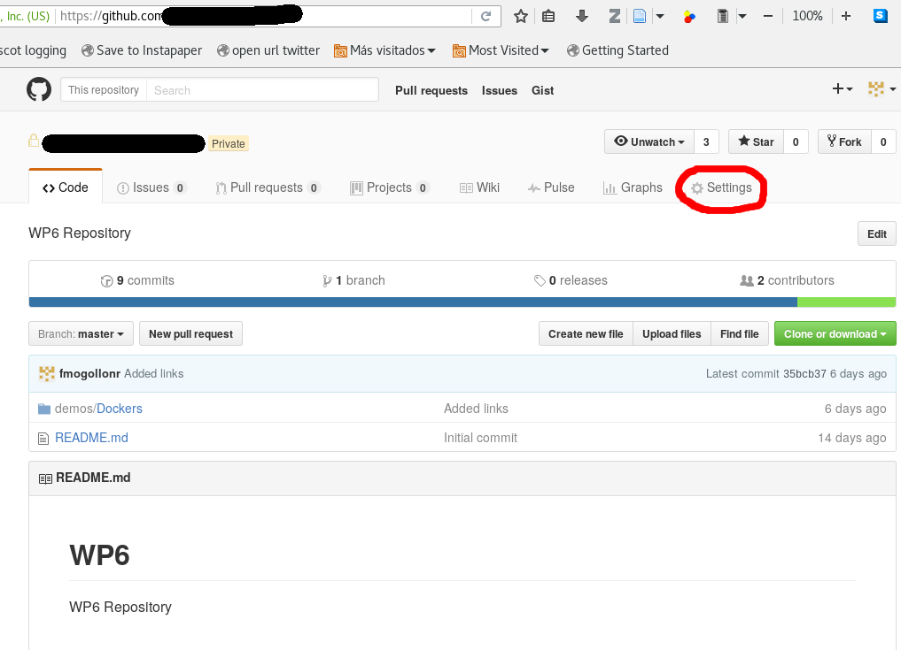
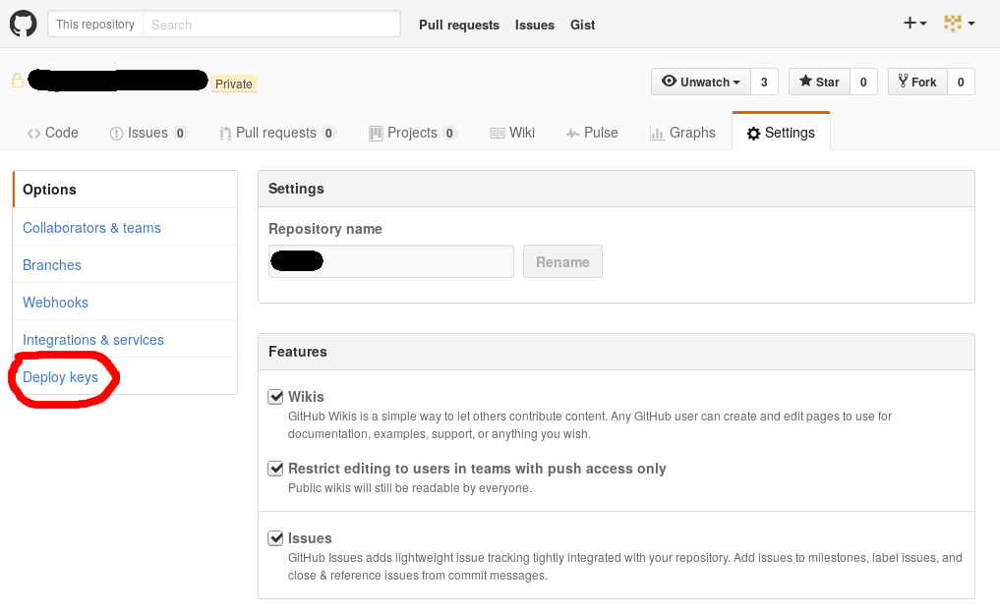
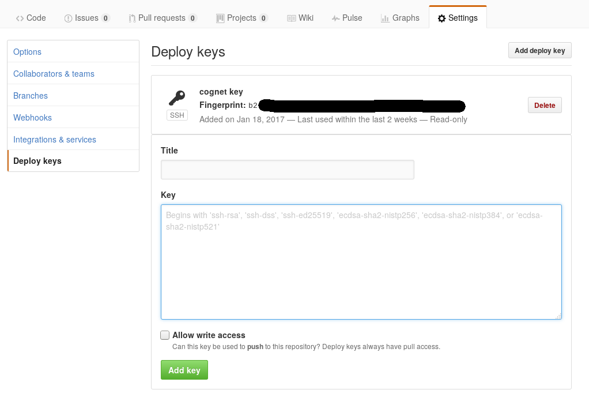

This folder contains an example of an ansible yml file that creates, deploys and launches a Docker image.

# Warning

All ips shown in this example are not updated, they are example ones.
Each time CogNet infrastructure is deployed different servers get new dynamic ips. There is an automatically updated list of those ips/hosts combination in [hosts](https://github.com/CogNet-5GPPP/demos_public/blob/master/hosts) file from demos_public repository.

## Navigation

[Ansible file][] | [Download Docker files][] | [Building Docker image][] | [Stopping previous Docker container][] | [Running Docker image][] | [Enable Github autologin][] | [Authors][] | [License][] 

# Components of the ansible file

This file will be used to create an run a new Docker instance containing our ML code. It can be divided into 3 parts:

1. Donwload Docker files
2. Building the Docker image
3. Launching Docker image


## Download Docker files

We will use github from CogNet to deploy new Dockers in docker virtual machine. To perform that action first step will be uploading Dockers files to Github.

There is a Github repository in the CogNet infrastructure called https://github.com/CogNet-5GPPP/demos_public/. User must upload their Docker directory to demos/Dockers directory.

```
- name: clone and update github repository
  hosts: docker
  remote_user: "{{ansible_user}}"
  become: yes
  tasks:

    - name: clone github repository
      git:
        repo: git@github.com:CogNet-5GPPP/demos_public.git
        dest: /home/cognet/repo/mydocker
        accept_hostkey: yes
        key_file: /home/cognet/rsa
        update: yes
```
This piece of the ansible will checkout Gihub repository and update it with new addings from different users.

* key_file: rsa file will hold the private rsa key that had been created to properly download and upload content from github repository. Refer to [Enable Github autologin][] to get more info about getting valid rsa keys.
* accept_hostkey: will accept ssh fingerprint from github automatically 
* update: will update existing repository from github


## Building Docker image

Then ansible will build Docker image:

```
- name: Build an image with the docker_image module
  hosts: docker
  remote_user: "{{ansible_user}}"
  become: yes
  tasks:

    - name: python dependencies
      pip: name={{item}} version=1.9.0
      with_items:

      - docker-py

    - name: build the image
      docker_image: >
        name=mysparkdemo
        tag=ontheedge
        path=/home/cognet/repo/demos/Dockers/demo_spark
        state=present
        api_version=1.18
```

This piece of ansible will build Docker image that has been uploaded previously to github;

* name: The name we want for our Docker image
* tag: The tag we want for our Docker image
* path: The path where Docker files will be hold (the files we want to "build")
* api_version: Docker api version **MUST be 1.18** for compatibility reasons.

Here we can edit the name we want for our Docker image, the tag and the path where our Docker files are stored to be built.

## Managing Docker containers

This piece of ansible will prepare the system to manage previous and new Docker containers.

```
- name: Create a data container
  hosts: docker
  remote_user: "{{ansible_user}}"
  become: yes
  vars:
    hosts_ip: "{ \"spark_master\":\"{{ hostvars.spark_master.ansible_ssh_host }}\",\"spark_slaves1\":\"{{ hostvars.spark_slaves1.ansible_ssh_host }}\", \"spark_slaves2\":\"{{ hostvars.spark_slaves2.ansible_ssh_host }}\", \"oscon\":\"{{ hostvars.oscon.ansible_ssh_host }}\",\"odl\":\"{{ hostvars.odl.ansible_ssh_host }}\",\"monasca\":\"{{ hostvars.monasca.ansible_ssh_host }}\",\"docker\":\"{{ hostvars.docker.ansible_ssh_host }}\",\"kafka\":\"{{ hostvars.kafka.ansible_ssh_host }}\",\"policy\":\"{{ hostvars.policy.ansible_ssh_host }}\"}"
 ```
 
We set *hosts_ip* variable from internal inventory file managed by Jenkins system. This way we can get hostname:ip tuple values  from inventory file in order to be added to */etc/hosts* file from each container. Nothing spceficic to be changed here. This is just for describing the internal functionality.

## Stopping previous Docker container


This piece of ansible will stop and remove previous running Docker container, this way new container can be built and started again.

```
  tasks:
    - name: Remove container
      docker_container:
        name: mysparkdemo
        image: "mysparkdemo:ontheedge"
        state: absent
```
* name must be a unique name for container, must be the same in removing and creating Docker container. To be set by user for the specific integration/deployment/demo.
* image variable must be the combination of imagename:imagetag we had defined in the previous section. To be set by user for the specific integration/deployment/demo.
* state:absent will indicate that the system must stop and remove the container

## Running Docker image

This part of the ansible file will cover the creating and running of a Docker container that holds the previous built of Docker image:

```
    - name: Create Container
      docker_container:
        name: mydocker
        image: "mysparkdemo:ontheedge"
        state: started
        etc_hosts: "{{ hosts_ip }}"
```
* name must be a unique name for container, must be the same in removing and creating Docker container. To be set by user for the specific integration/deployment/demo.
* image variable must be the combination of imagename:imagetag we had defined in the previous section. To be set by user for the specific integration/deployment/demo
* etc_hosts will hold the hostname:ip variables we had set up in the manage Dockers container section


## Enable Github autologin

There is an option in github to setup a RSA key that let clients pull and push data from github without human interaction.

This work only needs to be done once for each repository.

First step will be the generation of a RSA key, to do this we will run the following command:

```
$ ssh-keygen -t rsa -b 4096 -C "your@email.com"
```
You will be prompted for several data:

```
Enter file in which to save the key (/home/username/.ssh/id_rsa): /tmp/rsa
Enter passphrase (empty for no passphrase): 
Enter same passphrase again: 
Your identification has been saved in /tmp/rsa.
Your public key has been saved in /tmp/rsa.pub.
The key fingerprint is:
SHA256:hp+vG6zvZyni/CYoabaakmYfaAt685hAEvF4wup4jn8 your@email.com
The key's randomart image is:
+---[RSA 4096]----+
|.                |
|.+               |
|+.o              |
|.+     .         |
|o.    . S    .   |
|=  .   =... o    |
|+.+... +*. o     |
|.BB+E.. ++o      |
|o=*X++  oB=.     |
+----[SHA256]-----+
```

* File to store the key
* Passphrase **MUST BE EMPTY** to let the system connect without human interaction

Once you have generated your RSA key you will have two files

```
-rw------- 1 user group 3.2K Jan 31 10:22 rsa
-rw-r--r-- 1 user group  740 Jan 31 10:22 rsa.pub
```

* rsa will hold private key
* rsa.pub will hold public key that should be copied to Github

The private key is the one we are using in [Download Docker files][] section.

The public key is the one that we need to "upload" to our Github repository in order to let the system to be connected automatically.

To do this we need to be administrator of our repository. We go to our repository settings:



Then, we go to Deploy keys section:



And finally we have to click on the *Add deploy key* into your repository.



We will copy the content of the *rsa.pub* public key file into the dialog and click the *Add key* button.

This way we will have an accepted key to pull and push content from/to Github without any need of human interaction.


### Authors


- Angel Martin (amartin@vicomtech.org)
- Felipe Mogollon (fmogollon@vicomtech.org)

### License


Copyright 2016 Vicomtech.

Licensed under the Apache License, Version 2.0 (the "License"); you may not use this file except in compliance with the License. You may obtain a copy of the License at http://www.apache.org/licenses/LICENSE-2.0.

Unless required by applicable law or agreed to in writing, software distributed under the License is distributed on an "AS IS" BASIS, WITHOUT WARRANTIES OR CONDITIONS OF ANY KIND, either express or implied. See the License for the specific language governing permissions and limitations under the License.


[Ansible file]: #components-of-the-ansible-file
[Download Docker files]: #download-docker-files
[Building Docker image]: #building-docker-image
[Stopping previous Docker container]: #stopping-previous-docker-container
[Running Docker image]: #running-docker-image
[Enable Github autologin]: #enable-github-autologin
[Authors]: #authors
[License]: #license
